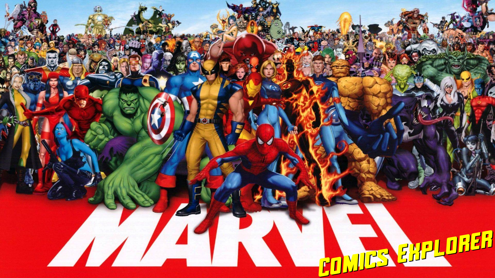

# Marvel Comics Explorer

# Live demo
[https://marvel-comics-explorer.herokuapp.com](https://marvel-comics-explorer.herokuapp.com)

# Setup
##### Prerequisites

The setups steps expect following tools installed on the system.

- Git
- Ruby 3.0.1
- Rails 6.1.4

##### 1. Clone the repository, cd into it and bundle install:

        $ git clone https://github.com/valterfernandesdev/marvel_comics_explorer.git
        $ cd marvel_comics_explorer
        $ bundle install
##### 2. Create database.yml file

Copy the sample database.yml file and edit the database configuration as required.

        $ cp config/database.yml.sample config/database.yml

##### 3. Create and setup the database

Run the following command to setup the database.

        $ rails db:setup

##### 4. Create config/master.key file and copy the key I sent you. (Or request me one)

 Create master key

        $ sudo touch config/master.key
Edit master key

        $ sudo nano config/master.key
        
##### 5. Install all yarn dependencies

Install yarn.

        $ yarn
##### 6. Start the Rails server

You can start the rails server using the command given below.

        $ rails s

And now you can visit the site with the URL http://localhost:3000
        
### Tests (RSpec)

1. Prepare your db to run the tests:

        $ rails db:test:prepare

2. Run the tests:

        $ bundle exec rspec

3. Now you can see the coverage of the project by opening:

        ./coverage/index.html
